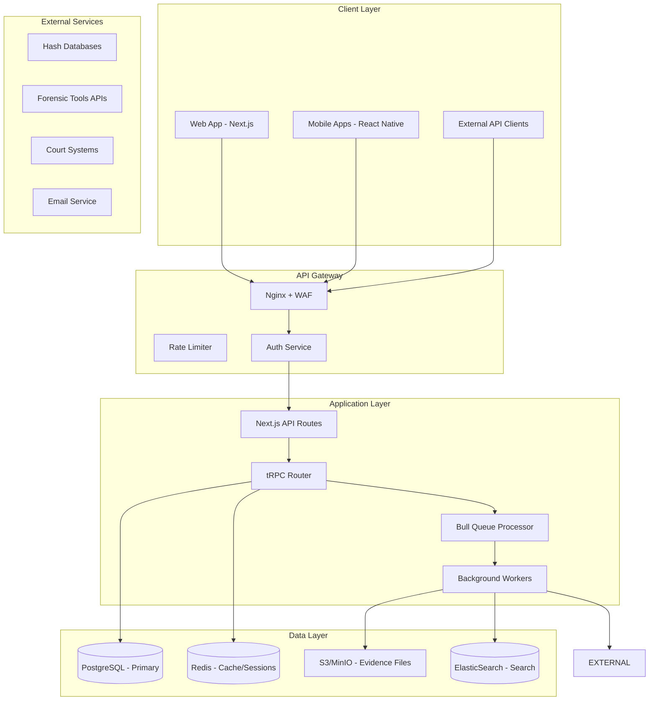
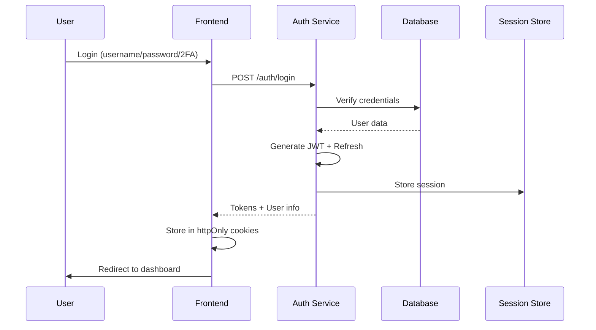

# Technical Architecture - Forensic Evidence Management System

## System Architecture Overview



## Database Schema (Core Tables)

### Evidence Items Table
```sql
CREATE TABLE evidence_items_v3 (
    -- Primary Keys
    id UUID PRIMARY KEY DEFAULT gen_random_uuid(),
    evidence_number TEXT UNIQUE NOT NULL, -- Format: YYYY-LAB-NNNNNN
    
    -- Basic Information
    case_id UUID REFERENCES cases(id),
    case_number TEXT NOT NULL,
    item_number TEXT NOT NULL,
    description TEXT NOT NULL,
    
    -- Classification
    item_type_id INTEGER REFERENCES item_types(id),
    item_subtype TEXT,
    priority ENUM('critical', 'high', 'normal', 'low') DEFAULT 'normal',
    
    -- Collection Details
    collected_date TIMESTAMP NOT NULL,
    collected_by TEXT NOT NULL,
    collection_location TEXT,
    collection_gps POINT,
    scene_id UUID REFERENCES scenes(id),
    
    -- Physical Properties
    make TEXT,
    model TEXT,
    serial_number TEXT,
    imei TEXT,
    color TEXT,
    size_dimensions JSONB,
    weight_grams INTEGER,
    condition TEXT,
    
    -- Digital Properties
    hash_md5 TEXT,
    hash_sha256 TEXT,
    hash_sha512 TEXT,
    file_size_bytes BIGINT,
    metadata JSONB,
    
    -- Current Status
    status ENUM('intake', 'stored', 'in_analysis', 'in_court', 'released', 'destroyed') DEFAULT 'intake',
    current_location_id INTEGER REFERENCES locations(id),
    current_custodian_id UUID REFERENCES users(id),
    
    -- Security
    classification ENUM('public', 'confidential', 'secret', 'top_secret') DEFAULT 'confidential',
    access_control JSONB, -- {"roles": [], "users": []}
    encryption_status BOOLEAN DEFAULT false,
    
    -- Metadata
    tags TEXT[],
    custom_fields JSONB,
    notes TEXT,
    retention_date DATE,
    disposal_date DATE,
    
    -- Audit
    created_by UUID REFERENCES users(id),
    created_at TIMESTAMP DEFAULT NOW(),
    updated_at TIMESTAMP DEFAULT NOW(),
    version INTEGER DEFAULT 1,
    
    -- Constraints
    UNIQUE(case_number, item_number)
);

-- Indexes for performance
CREATE INDEX idx_evidence_case ON evidence_items_v3(case_id);
CREATE INDEX idx_evidence_status ON evidence_items_v3(status);
CREATE INDEX idx_evidence_location ON evidence_items_v3(current_location_id);
CREATE INDEX idx_evidence_custodian ON evidence_items_v3(current_custodian_id);
CREATE INDEX idx_evidence_collected ON evidence_items_v3(collected_date);
CREATE INDEX idx_evidence_hash ON evidence_items_v3(hash_sha256);
CREATE INDEX idx_evidence_serial ON evidence_items_v3(serial_number);
CREATE INDEX idx_evidence_search ON evidence_items_v3 USING GIN(to_tsvector('english', description || ' ' || notes));
```

### Chain of Custody Table
```sql
CREATE TABLE custody_chain (
    id UUID PRIMARY KEY DEFAULT gen_random_uuid(),
    evidence_item_id UUID REFERENCES evidence_items_v3(id),
    transfer_number TEXT UNIQUE NOT NULL, -- Format: TRN-YYYY-NNNNNN
    
    -- Transfer Details
    transfer_type ENUM('intake', 'internal', 'analysis', 'court', 'release', 'disposal'),
    transfer_reason_id INTEGER REFERENCES transfer_reasons(id),
    transfer_reason_text TEXT,
    
    -- From
    from_custodian_id UUID REFERENCES users(id),
    from_location_id INTEGER REFERENCES locations(id),
    from_signature_id UUID REFERENCES signatures(id),
    from_timestamp TIMESTAMP,
    from_condition TEXT,
    from_photos UUID[],
    
    -- To
    to_custodian_id UUID REFERENCES users(id),
    to_location_id INTEGER REFERENCES locations(id),
    to_signature_id UUID REFERENCES signatures(id),
    to_timestamp TIMESTAMP,
    to_condition TEXT,
    to_photos UUID[],
    
    -- Verification
    verification_method ENUM('in_person', 'secure_transport', 'digital') DEFAULT 'in_person',
    witness_id UUID REFERENCES users(id),
    witness_signature_id UUID REFERENCES signatures(id),
    
    -- Documentation
    notes TEXT,
    special_instructions TEXT,
    environmental_conditions JSONB, -- {"temperature": 20, "humidity": 45}
    
    -- Status
    status ENUM('draft', 'pending', 'in_transit', 'completed', 'rejected') DEFAULT 'draft',
    rejected_reason TEXT,
    
    -- Metadata
    initiated_by UUID REFERENCES users(id),
    initiated_at TIMESTAMP DEFAULT NOW(),
    completed_at TIMESTAMP,
    
    -- Integrity
    blockchain_hash TEXT,
    external_ref TEXT
);
```

## API Design (tRPC Routes)

### Evidence Router
```typescript
export const evidenceRouter = router({
  // Queries
  list: protectedProcedure
    .input(z.object({
      page: z.number().default(1),
      limit: z.number().default(50),
      search: z.string().optional(),
      filters: z.object({
        status: z.enum(['all', 'intake', 'stored', 'in_analysis']).optional(),
        caseNumber: z.string().optional(),
        dateRange: z.object({
          start: z.date().optional(),
          end: z.date().optional()
        }).optional(),
        assignedTo: z.string().optional()
      }).optional(),
      sort: z.object({
        field: z.string().default('created_at'),
        direction: z.enum(['asc', 'desc']).default('desc')
      }).optional()
    }))
    .query(async ({ input, ctx }) => {
      // Implementation with RLS
    }),
    
  getById: protectedProcedure
    .input(z.string().uuid())
    .query(async ({ input, ctx }) => {
      // Fetch with full details + chain of custody
    }),
    
  getAnalytics: protectedProcedure
    .input(z.object({
      period: z.enum(['day', 'week', 'month', 'year']).default('month')
    }))
    .query(async ({ input, ctx }) => {
      // Return dashboard metrics
    }),
    
  // Mutations  
  create: protectedProcedure
    .input(evidenceCreateSchema)
    .mutation(async ({ input, ctx }) => {
      // Create with audit trail
    }),
    
  update: protectedProcedure
    .input(evidenceUpdateSchema)
    .mutation(async ({ input, ctx }) => {
      // Versioned update
    }),
    
  delete: adminProcedure
    .input(z.string().uuid())
    .mutation(async ({ input, ctx }) => {
      // Soft delete with reason
    }),
    
  // Specialized operations
  bulkImport: protectedProcedure
    .input(z.array(evidenceCreateSchema))
    .mutation(async ({ input, ctx }) => {
      // Queue for processing
    }),
    
  generateReport: protectedProcedure
    .input(reportGenerationSchema)
    .mutation(async ({ input, ctx }) => {
      // Queue PDF generation
    })
});
```

## Security Architecture

### Authentication Flow


### Row Level Security (RLS)
```sql
-- Evidence access policy
CREATE POLICY evidence_access ON evidence_items_v3
    FOR ALL
    TO authenticated_users
    USING (
        -- User can access if:
        -- 1. They are assigned to the case
        -- 2. They are the current custodian
        -- 3. They have explicit access granted
        -- 4. They have admin role
        auth.uid() IN (
            SELECT user_id FROM case_assignments WHERE case_id = evidence_items_v3.case_id
        ) OR
        current_custodian_id = auth.uid() OR
        auth.uid() = ANY((access_control->>'users')::uuid[]) OR
        auth.has_role('admin')
    );
```

## Performance Optimization

### Caching Strategy
```typescript
// Redis caching layers
const cacheKeys = {
  evidence: (id: string) => `evidence:${id}`,
  evidenceList: (filters: string) => `evidence:list:${hash(filters)}`,
  userPermissions: (userId: string) => `permissions:${userId}`,
  analytics: (period: string) => `analytics:${period}:${today()}`,
  report: (id: string) => `report:${id}`
};

// Cache invalidation
const invalidateEvidenceCache = async (evidenceId: string) => {
  await redis.del(cacheKeys.evidence(evidenceId));
  await redis.del(cacheKeys.evidenceList('*')); // Pattern delete
  await redis.del(cacheKeys.analytics('*'));
};
```

### Database Optimization
```sql
-- Materialized view for analytics
CREATE MATERIALIZED VIEW evidence_analytics AS
SELECT 
    DATE_TRUNC('day', created_at) as date,
    status,
    item_type_id,
    COUNT(*) as count,
    AVG(EXTRACT(EPOCH FROM (updated_at - created_at))/86400) as avg_processing_days
FROM evidence_items_v3
GROUP BY DATE_TRUNC('day', created_at), status, item_type_id;

-- Refresh daily
CREATE OR REPLACE FUNCTION refresh_analytics()
RETURNS void AS $$
BEGIN
    REFRESH MATERIALIZED VIEW CONCURRENTLY evidence_analytics;
END;
$$ LANGUAGE plpgsql;
```

## Integration Architecture

### Forensic Tool Integration
```typescript
// Abstract interface for tool integrations
interface ForensicToolAdapter {
  name: string;
  version: string;
  
  // Import evidence from tool
  importEvidence(caseId: string, options: ImportOptions): Promise<Evidence[]>;
  
  // Export evidence to tool
  exportEvidence(evidenceIds: string[], format: ExportFormat): Promise<Buffer>;
  
  // Sync analysis results
  syncResults(evidenceId: string): Promise<AnalysisResult>;
  
  // Validate connection
  validateConnection(): Promise<boolean>;
}

// Example: Cellebrite integration
class CellebriteAdapter implements ForensicToolAdapter {
  async importEvidence(caseId: string, options: ImportOptions) {
    const client = new CellebriteAPIClient(this.config);
    const extractions = await client.getExtractions(caseId);
    
    return extractions.map(ext => ({
      description: `${ext.deviceInfo.make} ${ext.deviceInfo.model}`,
      serial_number: ext.deviceInfo.serial,
      imei: ext.deviceInfo.imei,
      hash_sha256: ext.dataHash,
      metadata: {
        extraction_id: ext.id,
        extraction_date: ext.date,
        examiner: ext.examiner,
        tool_version: ext.version
      }
    }));
  }
}
```

## Deployment Architecture

### Kubernetes Deployment
```yaml
apiVersion: apps/v1
kind: Deployment
metadata:
  name: evidence-mgmt-web
spec:
  replicas: 3
  selector:
    matchLabels:
      app: evidence-mgmt-web
  template:
    metadata:
      labels:
        app: evidence-mgmt-web
    spec:
      containers:
      - name: web
        image: evidence-mgmt:latest
        ports:
        - containerPort: 3000
        env:
        - name: DATABASE_URL
          valueFrom:
            secretKeyRef:
              name: db-credentials
              key: url
        resources:
          requests:
            memory: "512Mi"
            cpu: "250m"
          limits:
            memory: "1Gi"
            cpu: "1000m"
        livenessProbe:
          httpGet:
            path: /api/health
            port: 3000
          initialDelaySeconds: 30
          periodSeconds: 10
```

### Infrastructure as Code (Terraform)
```hcl
# RDS PostgreSQL for production
resource "aws_db_instance" "evidence_db" {
  identifier     = "evidence-mgmt-prod"
  engine         = "postgres"
  engine_version = "15.4"
  instance_class = "db.r6g.xlarge"
  
  allocated_storage     = 500
  max_allocated_storage = 2000
  storage_encrypted     = true
  
  vpc_security_group_ids = [aws_security_group.rds.id]
  db_subnet_group_name   = aws_db_subnet_group.main.name
  
  backup_retention_period = 30
  backup_window          = "03:00-04:00"
  maintenance_window     = "sun:04:00-sun:05:00"
  
  deletion_protection = true
  
  tags = {
    Name        = "evidence-mgmt-prod"
    Environment = "production"
    Compliance  = "CJIS"
  }
}
```

## Monitoring & Observability

### Metrics Collection
```typescript
// Prometheus metrics
import { Counter, Histogram, register } from 'prom-client';

export const metrics = {
  evidenceCreated: new Counter({
    name: 'evidence_created_total',
    help: 'Total number of evidence items created',
    labelNames: ['type', 'priority']
  }),
  
  transferDuration: new Histogram({
    name: 'custody_transfer_duration_seconds',
    help: 'Duration of custody transfers',
    labelNames: ['type'],
    buckets: [0.1, 0.5, 1, 2, 5, 10, 30, 60]
  }),
  
  apiLatency: new Histogram({
    name: 'api_request_duration_seconds',
    help: 'API request latency',
    labelNames: ['method', 'route', 'status'],
    buckets: [0.01, 0.05, 0.1, 0.5, 1, 2, 5]
  })
};

// Usage
metrics.evidenceCreated.labels('mobile_device', 'high').inc();
```

This technical architecture ensures the Evidence Management System is:
- **Scalable:** Handles millions of evidence items
- **Secure:** Multiple layers of protection
- **Fast:** Sub-second response times
- **Reliable:** 99.9% uptime
- **Compliant:** Meets all forensic standards

*Built for truth. Engineered for justice.* ☥